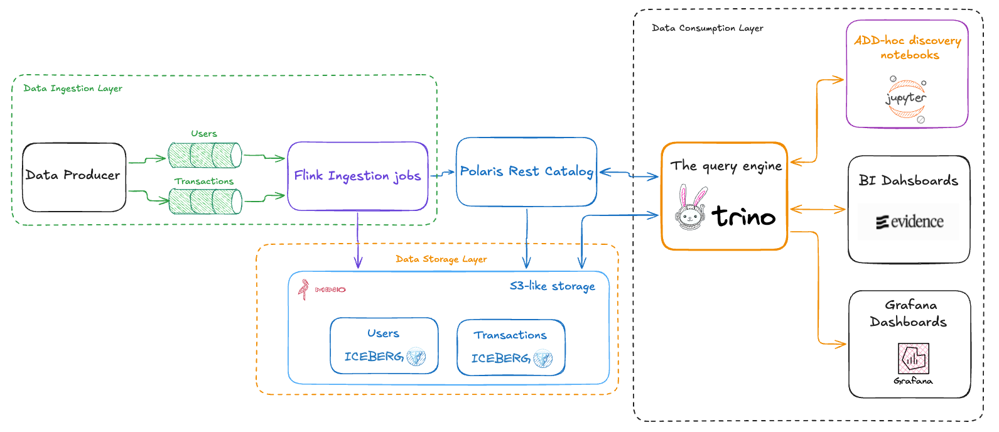

# Kafka → Iceberg via Flink 

A self-contained demo that streams synthetic JSON events from Kafka into Apache
Iceberg tables using Apache Flink, with a live BI dashboard powered by Evidence.

## Architecture




## Services

| Service             | Image / Build                              | Exposed port       |
|---------------------|--------------------------------------------|--------------------|
| kafka               | apache/kafka:4.0.2 (KRaft, no ZooKeeper)   | 9092               |
| minio               | minio/minio                                | 9000, 9001 (UI)    |
| minio-init          | minio/mc (creates bucket on first boot)    | —                  |
| polaris             | apache/polaris:latest                      | 8181, 8182 (health)|
| flink-jobmanager    | custom (Flink + Iceberg + S3 JARs)         | 8081 (UI)          |
| flink-taskmanager   | custom                                     | —                  |
| flink-sql-job       | custom (submits SQL job then exits)        | —                  |
| jupyter             | custom (Python + Trino client)             | 8888               |
| evidence            | custom (Node 20, Evidence 40.x)            | 3000               |
| grafana             | grafana/grafana:11.5.2 (+ trino-datasource)| 3100               |
| kafka-producer      | custom (Python 3, kafka-python)            | —                  |

## Quick start

```bash
docker compose up --build
```

First boot takes a few minutes while Docker builds the images and the Flink SQL
job is submitted. Iceberg commits happen on Flink checkpoints (every 30 s), so
wait at least 30 seconds before expecting data in the dashboard.

## Kafka topics & event schemas

Two topics are produced by the Python producer:

**users**
```json
{ 
   "user_id": "user-001", 
   "name": "Alice Smith", 
   "email": "alice.smith1@example.com",
   "country": "US", 
   "created_at": "2024-04-22T10:00:00.000"
}
```

**transactions**
```json
{ 
   "transaction_id": "txn-000001", 
   "user_id": "user-001", 
   "amount": 149.99,
   "currency": "USD", 
   "type": "PURCHASE", 
   "status": "COMPLETED",
   "event_time": "2024-04-22T10:00:00.000"
}
```

Users are seeded upfront so transactions always reference a valid `user_id`.
The producer then streams transactions continuously at a configurable rate
(default: 2 events/sec, set via `EVENTS_PER_SECOND`).

## Iceberg catalog (Polaris)

Flink and Trino both share the same catalog via Apache Polaris's Iceberg REST
API at `http://polaris:8181/api/catalog`, authenticated with OAuth2 client
credentials. Jupyter, Evidence, and Grafana all read through Trino. The two
Iceberg tables are:

- `iceberg_catalog.demo.users`
- `iceberg_catalog.demo.transactions`

## Endpoints

| Service     | URL                                         | Credentials              |
|-------------|---------------------------------------------|--------------------------|
| Evidence BI | http://localhost:3000                       | —                        |
| Grafana     | http://localhost:3100                       | admin / admin            |
| Flink UI    | http://localhost:8081                       | —                        |
| JupyterLab  | http://localhost:8888                       | no password              |
| MinIO UI    | http://localhost:9001                       | minioadmin / minioadmin  |
| Polaris API | http://localhost:8181/api/catalog/v1/config | root / s3cr3t (OAuth2)   |

## Evidence dashboard

The Evidence dashboard at **http://localhost:3000** shows live metrics sourced
from the Iceberg tables. On startup it:

1. Runs `evidence sources` — executes the SQL queries in `sources/demo_lh/`
   against Trino and writes Parquet snapshots to
   `.evidence/template/static/data/`.
2. Starts the Vite dev server which serves the dashboard at port 3000.

The page (`pages/index.md`) uses inline SQL code blocks that query the
pre-built Parquet snapshots loaded by Evidence's frontend in the browser:

```sql
select * from demo_lh.kpis
```

To refresh data without rebuilding the container:

```bash
docker exec evidence node_modules/.bin/evidence sources
```

## Grafana monitoring dashboard

Grafana at **http://localhost:3100** (admin / admin) opens directly on the
**Iceberg Monitoring** dashboard, which surfaces health signals from Iceberg's
metadata tables:

- Health KPIs per table — total records, total commits, average data-file
  size, minutes since the last commit
- Commit cadence — commits and records added per 5-minute window
- Records growth — cumulative total records and per-commit deltas
- File distribution — current data-file count, size buckets, totals
- Manifest health — active manifests, orphaned-manifest estimate, pending
  deletes
- Daily stats — added records and commit counts per day

A `target_table` dashboard variable filters/repeats panels for `transactions`,
`users`, or both.

Data path: Grafana → Trino (`trino-datasource` plugin) → Polaris REST catalog
→ MinIO. Provisioning lives in:

- `docker/grafana/provisioning/datasources/trino.yaml` — Trino datasource
- `docker/grafana/provisioning/dashboards/dashboard.yaml` — dashboard provider
- `docker/grafana/dashboards/iceberg-monitoring.json` — dashboard JSON

To edit the dashboard, modify the JSON and restart the container:

```bash
docker compose restart grafana
```

## JupyterLab exploration

Open **http://localhost:8888**. Two notebooks ship with the demo, both
querying through the Trino coordinator:

- `trino_ad_hoc_iceberg_tables_research.ipynb` — ad-hoc analytics on
  `iceberg.demo.users` and `iceberg.demo.transactions`
- `trino_iceberg_metadata.ipynb` — guided tour of Iceberg metadata tables
  (`$history`, `$snapshots`, `$files`, `$manifests`, `$partitions`, `$refs`,
  `$entries`)

## Query from Flink SQL client

```bash
docker exec -it flink-jobmanager /opt/flink/bin/sql-client.sh
```

```sql
USE CATALOG iceberg_catalog;
USE demo;

SELECT status, COUNT(*) AS cnt FROM transactions GROUP BY status;
```

## Tear down

```bash
docker compose down -v
```